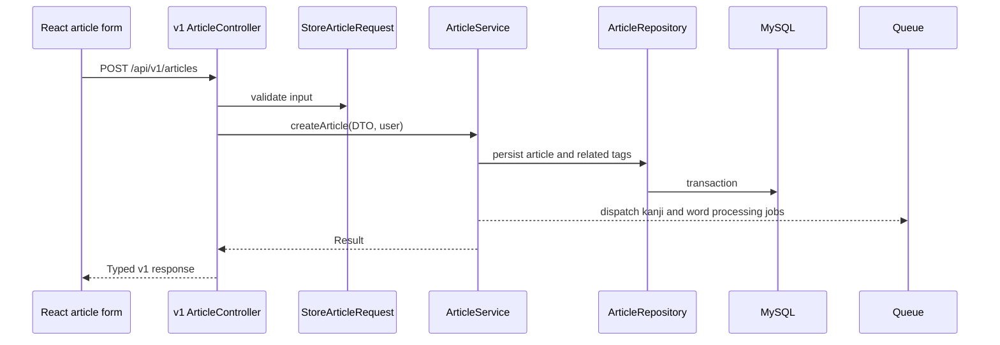
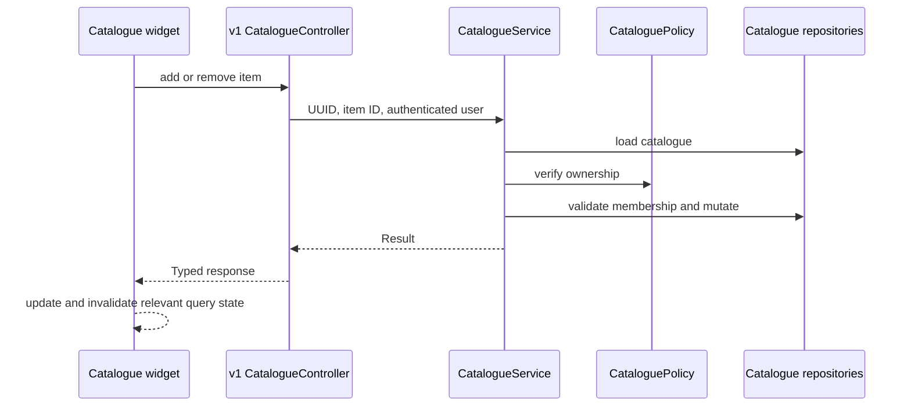

# Application Boundaries

> **Status:** Baseline; verified current and target flows separated
> **Last reviewed:** 2026-08-18
> **Evidence baseline:** Repository working tree inspected on 2026-08-18
> **Audience:** Frontend and backend engineers, reviewers, and AI-assisted contributors

## Boundary Principle

Japanese VMA is a modular monolith with a separate React client. Scalability work starts with understandable module seams and dependency direction, not with a default split into services.

## Frontend

### Target flow

```text
route
  -> feature component
  -> feature API module or React Query hook
  -> Orval-generated client
  -> Laravel v1 endpoint
```

Responsibilities:

| Boundary | Owns | Does not own |
|---|---|---|
| Route | Parameters, search mapping, query wiring, and loading/error gates | Raw endpoint strings, large forms, or persistence-shaped transformations |
| Feature component | User interaction and feature-specific composition | Shared server-state policy or generated transport details |
| Feature API/query module | Query keys, pagination flattening, mapping, invalidation, and justified compatibility seams | Pure renaming of a usable generated client |
| Generated client | Typed HTTP transport from OpenAPI | Product decisions or UI state |

Articles and catalogues contain the strongest current precedents in `client/src/api/articles/`, `client/src/api/catalogues/`, `client/src/routes/ArticlesList/`, and `client/src/routes/CataloguesList/`.

### Legacy/debt flow

```text
route or class component
  -> raw apiCall endpoint string
  -> legacy Laravel controller
```

Community post routes and parts of the Japanese-resource detail surface still exhibit this shape. Existing code may remain until its replacement contract is ready, but new work should not spread it.

## Backend

### Target v1 flow

```text
route
  -> controller
  -> request validation
  -> DTO or value object
  -> application service, action, or policy
  -> repository interface
  -> infrastructure repository, mapper, or builder
  -> resource
  -> TypedResults
```

Responsibilities:

| Layer | Owns | Does not own |
|---|---|---|
| HTTP | Transport validation, identity extraction, mapping, and response selection | Business orchestration or persistence queries |
| Application | Use-case orchestration, authorization, transactions, side effects, and repository interfaces | HTTP requests/responses or Eloquent leakage |
| Domain | DTOs, models, value objects, enums, invariants, and typed errors | Laravel transport or persistence types |
| Infrastructure | Eloquent models, queries, repositories, mappers, and external adapters | Presentation decisions |
| Shared v1 result layer | Consistent success/failure mapping | Feature-specific business rules |

### Representative article write



### Representative catalogue item mutation



## Cross-Boundary Rules

- Fix generated contract drift at the backend schema source before adding frontend coercion.
- Run schema generation before Orval so the client never reads a stale `processor-api/api.json`.
- Keep authorization in backend policy/application boundaries even when the UI hides controls.
- Keep compatibility adapters explicit and removable; do not disguise legacy transport as domain architecture.
- Preserve legacy routes until active callers are migrated and retirement is separately verified.

## Related Views

- [Current-to-target state](../ai/current-target-state.md)
- [Evidence manifest](../ai/evidence-manifest.md)
- [Legacy-to-v1 backlog](../legacy-v1-migration/backend-frontend-issue-backlog.md)
