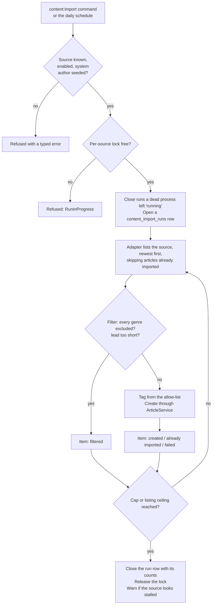

# Content Import

> **Status:** Current; describes the Content Import as merged with epic #404
> **Last reviewed:** 2026-10-06
> **Evidence baseline:** Branch `feature/issue-404-content-import` (PR #425), and a read-only survey of the background-job and import code in the two reference solutions called **Project K** and **Project B** in [the comparison backlog](./architecture-comparison-backlog.md)
> **Audience:** Backend contributors, and anyone adding a new Content Source or running imports in production

The Content Import reads articles from an external publisher (a **Content Source**, today NHK News) and creates them on the platform as **Imported Articles**: the headline, the publisher's own short lead and a link back. One execution against one source is an **Import Run**. These terms are defined in [`CONTEXT.md`](../../CONTEXT.md).

This document explains how an Import Run works, names the patterns it uses and why, and compares them with how Projects K and B run their imports. Use it as the reference when adding a source or another scheduled import.

## One Import Run, step by step

Where the code lives:

| Part | Path under `processor-api/app/` |
|---|---|
| The run's work: list, filter, tag, create | `Application/ContentImport/Services/ContentImportService.php` |
| Everything around the work: lock, run row, failures, stall warning | `Application/ContentImport/Runs/ImportRunRecorder.php` |
| One adapter per source, and how adapters are found | `Application/ContentImport/Interfaces/ContentSourceAdapterInterface.php`, `Infrastructure/ContentImport/ConfigContentSourceAdapterRegistry.php` |
| The NHK News adapter and page parser | `Infrastructure/ContentImport/Sources/Nhk/` |
| Polite HTTP and robots.txt | `Infrastructure/ContentImport/Http/` |
| Tagging | `Application/ContentImport/Tagging/MappingArticleTagger.php` |
| Limits and filters | `Domain/ContentImport/ValueObjects/ImportRunSettings.php`, `config/content_import.php` |
| Command and schedule | `Console/Commands/ImportContent.php`, `Console/Kernel.php` |

## Patterns used, and why

### Reading the source

- **Adapter per source.** Each Content Source has one class implementing `ContentSourceAdapterInterface`. It is the only code that knows the source's format (for NHK: a Google News sitemap and the `NewsArticle` JSON-LD on each page). It hands the rest of the import a plain `ExternalArticle`, so nothing past the adapter is NHK-specific. Adding a source means writing one adapter and seeding one `content_sources` row.
- **Registry from config.** `content_import.sources.<key>.adapter` names the adapter class, and the registry resolves it from the container. Tests swap in `FakeContentSourceAdapter` by rebinding that class.
- **Lazy listing.** `listRecent()` yields one article at a time (a PHP generator). The run stops asking once a limit is reached, so a page is never fetched just to be thrown away.
- **Skip what is already imported.** Before fetching an article's page, the adapter asks `ArticleService::hasImportedArticle()`. Known articles are skipped without any HTTP request. The adapter skips them rather than stopping at the first one, so an article that failed on an earlier run is tried again while the source still lists it.
- **Polite crawling.** All traffic goes through `PoliteHttpClient`: a User-Agent that names the bot and links to the site, a 15-second timeout, a fixed pause between requests (1 second by default), and up to three attempts on connection errors and 5xx answers only. `RobotsTxtPolicy` reads each host's robots.txt once per run and follows RFC 9309. A missing robots.txt (4xx) allows everything. One that cannot be fetched (5xx or network error) disallows everything, so the run fails rather than guessing.
- **Fail the item or fail the run.** A page removed after the sitemap was built (404 or 410) is skipped. One page that keeps answering 5xx, or has no readable `NewsArticle` block, is skipped and listed again next run. Three unreadable pages in a row, an unreadable sitemap or a robots.txt refusal mean the source as a whole cannot be read. The adapter then throws `ContentSourceUnavailableException`, and the run ends as failed.

### Turning a source article into a platform article

- **Allow-list tagging.** Hashtags come only from `source_tag_mappings`, which maps the source's own genres and topics to platform hashtags. Topics are tried first because they are more specific, and an article gets at most three tags. An unmapped topic is dropped and logged once per run, so the list can grow from what the source actually publishes. Imports never invent tags.
- **One creation path.** An Imported Article is created through `ArticleServiceInterface::createArticle()`, the same path a person's article takes. It shares the same transaction, tag attachment, pending processing state and after-commit dispatch of the processing job. Only the author (a seeded system user that cannot sign in), the origin and the provenance differ. Imported Articles start approved, so they stay out of the moderation queue.
- **Provenance and a natural key.** `articles.origin`, `content_source_id` and `external_id` record where an article came from. A unique index on `(content_source_id, external_id)` makes importing the same external article twice impossible, even if two runs race.

### Running safely

- **One run per source at a time, enforced by the run.** `ImportRunRecorder` takes a cache lock named `content-import:<source key>` before doing anything, so the rule holds however the run was started: the schedule, the command line, or anything added later. A second run gets `ContentImport.RunInProgress` and exits non-zero. The lock expires after two hours, so a process that dies holding it blocks the source for at most that long. A dry run takes no lock, because it writes nothing.
- **A duplicate is an outcome, not a crash.** If two runs still race (for example, on hosts that do not share a cache store), the second insert hits the unique index. The repository turns that into `ArticleAlreadyImportedException`, the transaction rolls back (no article, no tags, no processing job), and the run records the item as `already_imported` and carries on.
- **A run record that always closes.** Every non-dry run has a `content_import_runs` row with its status and counts. The recorder closes it whatever the work does, including throwing an unexpected error. A row left `running` by a killed process is closed as failed by the next run of that source: while the next run holds the lock, no other run can be live.
- **Bounded work.** `max_created_per_run` caps articles created per run. `max_listed` caps how many listed articles a run may look at, filtered or not, so a source full of filtered items cannot keep a run busy.
- **Stalled-source warning.** An unofficial source rarely breaks with an error; it breaks by quietly returning nothing. When the last few successful runs (three by default) created nothing, the run logs a warning and the command prints one.
- **Typed settings.** `ImportRunSettings` holds the limits and filter rules. `config/content_import.php` sets defaults and per-source overrides. A missing setting is a configuration error, not a silent zero.
- **Kill switch and dry run.** `content_sources.enabled = false` stops a source without a deploy. `php artisan content:import --dry-run` lists, filters and tags but writes nothing.
- **Expected failures are results.** Unknown source, disabled source, missing system user, run in progress and "already imported" come back as typed `Result` failures. Exceptions are only used at the edges: an unreadable source, or a bug.

### Testing

- Tests never touch the network. `NhkNewsAdapterTest` serves synthetic fixtures from `tests/Fixtures/nhk/` through `Http::fake()` with stray requests forbidden.
- `ContentImportServiceTest` drives the run through `ContentImportServiceInterface` with `FakeContentSourceAdapter`. It covers the limits, filters, retrying a failed article, the lock, a crash, the race on the unique index, abandoned runs and dry runs.
- `ImportContentCommandTest` runs the real NHK adapter on the fixtures end to end.

## How Projects K and B compare

Both reference solutions run imports as background jobs in a shared job layer, described here only by abstraction.

| Concern | Project K and Project B | Content Import | Why the difference |
|---|---|---|---|
| Only one copy of a job at a time | Every job goes through a shared wrapper that fingerprints the job type and its parameters under a distributed lock, and cancels a second copy, whatever started it. | The Import Run takes a per-source lock itself (`ImportRunRecorder`). | Same idea, scoped to one module: there is one scheduled import, so a shared job layer would have a single user. |
| Retries | Opt-in per job type: none by default, a fixed number of attempts on a dedicated wrapper. | HTTP retries on connection errors and 5xx only. A failed article is retried by later runs while the source lists it. | The run is cheap to repeat and runs daily, so the next run is the retry. |
| Record of each item | Project K writes one ingestion-log row per product (status, error, raw payload, trace id), and its message consumers move a message that keeps failing to a dead-letter queue. | Counts per run in `content_import_runs`; per-item outcomes only in logs and the command output. | Deferred until the run counts show refetching or repeated failures matter: [#500](https://github.com/av3000/japanese-vma/issues/500). |
| Knowing what is new | Project K's product-information import starts from the date of the last import. Project B moves a per-job "last success" time forward only after a successful run. | A per-article check against the natural key. | NHK's sitemap is a short rolling window (about two days), and a lookup by key is cheap, so a watermark would add state without saving work. |
| Duplicates | Project K's repositories insert "ignoring existing" rows, and its tests assert a repeated batch changes nothing. | Unique index, with the violation turned into an `already_imported` outcome. | An insert that ignores conflicts (`ON CONFLICT DO NOTHING`) would remove the exception path. It is not worth it while the lock makes the race rare. |
| Run progress and logs | A job context writes progress lines to the job dashboard. Project B adds per-job metrics. | Structured log lines, the run row and the command's summary table (`-v` for every item). | No job dashboard for console commands yet. A Filament page for import runs is a planned follow-up. |

## Running it in production

The [Content Import runbook](../runbooks/content-import.md) owns this: the first-time setup checklist (including the seeders the release pipeline does not run), the options for running it daily without an always-on host, and troubleshooting.

## Adding a Content Source

1. Write an adapter implementing `ContentSourceAdapterInterface`: list newest first, lazily, skip what `$isKnown` reports, return `ExternalArticle`s, and throw `ContentSourceUnavailableException` when the source as a whole cannot be read. Send every request through `PoliteHttpClient` and check `RobotsTxtPolicy` first.
2. Register it under `content_import.sources.<key>` with its overrides, and bind it in `ContentImportServiceProvider` if it needs constructor arguments.
3. Seed its `content_sources` row and its `source_tag_mappings`.
4. Test it on saved fixtures with `Http::fake()` and `Http::preventStrayRequests()`, never against the live site.
5. Check the source's terms and robots.txt before enabling it, and import only what you may republish (for NHK: headline, lead and link).

## Related Documents

- [Content Import runbook](../runbooks/content-import.md)
- [Data and integrations](./data-and-integrations.md)
- [Architecture comparison backlog](./architecture-comparison-backlog.md), rows 20, 22 and 27
- [Deployment and runtime](./deployment-and-runtime.md)
- ADR [0001: Article processing model](../adr/0001-article-processing-model.md), the processing state every Imported Article also gets
