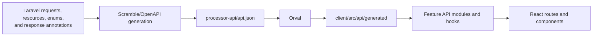

# Data and Integrations

> **Status:** Baseline; repository-backed integrations distinguished from runtime assumptions
> **Last reviewed:** 2026-08-18
> **Evidence baseline:** Repository working tree inspected on 2026-08-18
> **Audience:** Backend, frontend, data, and operations contributors

## Data Domains

| Domain | Representative data |
|---|---|
| Identity | Users, roles, permissions, profiles, authentication tokens |
| Content | Articles, posts, comments, hashtags, engagement statistics |
| Study material | Kanji, radicals, words, sentences, readings, meanings, JLPT and grade metadata |
| Organization | Catalogues, catalogue types, catalogue items, ownership, publicity |
| Processing | Article extraction status, last-operation state, background jobs |
| Output | PDF documents and download records |

The v1 backend aims to translate persistence records into domain shapes through repositories and mappers. Legacy code may still expose Eloquent-oriented or transport-oriented shapes directly.

## Japanese Reference Data

Repository documentation identifies Electronic Dictionary Research and Development Group datasets, including JMdict, KANJIDIC, JMnedict, and Radkfile, as core reference inputs. Sentence-oriented material also includes Tatoeba-linked content where supported by the imported data.

Import and migration code under `processor-api/database/` and the Japanese-data application/infrastructure modules is the implementation authority. Dataset licensing, update cadence, and production import freshness were not externally verified in this review.

## API Contract Generation

The required order is schema source first, then OpenAPI generation, then inspection of `processor-api/api.json`, then Orval generation. Generated files are never hand-edited to hide a backend schema problem.

## Queue and Realtime Boundaries

- Article create/update can dispatch kanji and word processing jobs.
- Last-operation state records processing progress and can be delivered to the frontend through the realtime integration.
- Redis is configured as a coordination boundary for queues/cache and production worker sharing.
- The web runtime produces work; the separately deployed worker consumes it.

Job payload compatibility is a deployment concern because web and worker revisions may overlap.

## PDF Boundary

Article and catalogue PDF exports use application-level export services and a shared renderer interface. Current v1 routes support article kanji/word exports and catalogue kanji/word exports. Legacy catalogue routes still expose radical and sentence PDF paths; these should not be described as completed v1 functionality.

## Engagement Boundary

Comments, likes, hashtags, views, and downloads use shared object-template identifiers to associate behavior with several entity types. Read endpoints can remain resource-specific while generic write endpoints accept an entity type and identifiers.

This polymorphic boundary requires careful validation: numeric IDs, UUIDs, and object type must describe the same target. Current repository guidance explicitly treats the validated tuple as the write contract for generic comments.

## External and Platform Integrations

| Integration | Repository evidence | Verification state |
|---|---|---|
| GitHub Actions | `.github/workflows/frontend-ci.yml` | Configuration verified |
| GitLab CI | `.gitlab-ci.yml` | Configuration verified |
| Render | Pipeline and repository guidance | Configuration verified; provider state open |
| GCP worker VM | Pipeline and repository guidance | Configuration verified; VM state open |
| Upstash Redis | Repository guidance and environment/config references | Intended production dependency; live connection open |
| Sentry | Frontend provider/dependency references | Client integration present; project ingestion open |
| Laravel Reverb | Backend/frontend dependencies and integration code | Implementation present; live channel health open |

## Integrity Rules

- Keep DTO/domain types free of HTTP and Eloquent dependencies.
- Keep generated API types synchronized with backend resource schemas.
- Use dedicated test databases for DB-backed backend verification.
- Treat imports and background processing as idempotency and observability concerns.
- Do not infer production freshness or provider health from source configuration alone.

## Related Documents

- [System context](./system-context.md)
- [Deployment and runtime](./deployment-and-runtime.md)
- [Current-to-target state](../ai/current-target-state.md)
- [Japanese study material](../feature-artifacts/japanese-study-material/abstract.md)
