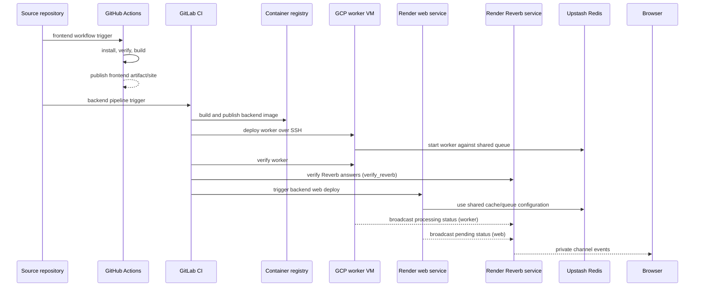

# Deployment and Runtime

> **Status:** Baseline; repository configuration verified, provider state unverified
> **Last reviewed:** 2026-09-20
> **Evidence baseline:** Repository working tree and `.gitlab-ci.yml` inspected on 2026-09-20; provider dashboards not inspected
> **Audience:** Engineers, operators, incident responders, and reviewers

## Runtime Topology

The production topology is intentionally cross-system:

| Concern | Configured owner |
|---|---|
| Frontend verification and deploy | GitHub Actions |
| Backend image build and orchestration | GitLab CI |
| Backend web service | Render |
| Real-time transport (Laravel Reverb) | Render, always-on web service `japanese-vma-reverb` running the backend image with `php artisan reverb:start --host=0.0.0.0 --port=$PORT` (ADR 0002) |
| Queue worker | Docker Compose on a GCP VM |
| Shared Redis queue/cache coordination | Upstash Redis |
| Primary application persistence | PostgreSQL database configuration |

This review verified repository configuration and contributor guidance. It did not inspect provider dashboards or make live requests.

**The Reverb row is a target, not a verified deployment.** The application code, the channel
authorisation, the CI wiring and the `verify_reverb` job are all in the repository, but the
Render service and the platform variables it needs have not been created yet (issue #262). Until
they are, the backend pipeline fails deliberately on the missing `REVERB_*` variables rather
than deploying a worker that cannot broadcast, and every client falls back to polling.

## Deployment Flow

### Real-time transport

Processing status reaches the browser over Laravel Reverb (ADR 0002). Producers are the queue worker (every status transition) and the web service (`pending`, written in the create/update transaction). The browser subscribes to `private-processing_states.{article uuid}` on the detail page and to `private-App.User.{user uuid}` on the owner dashboard; public lists poll. Polling remains the correctness baseline, so a Reverb outage degrades to the 5 s / 15 s polling cadence rather than breaking the UI.

Configuration lives in platform variables, never in the repository:

| Where | Variables |
|---|---|
| Render Reverb service | `APP_KEY`, `APP_ENV=production`, `REVERB_APP_ID`, `REVERB_APP_KEY`, `REVERB_APP_SECRET`, `REVERB_SERVER_HOST=0.0.0.0`, `REVERB_SERVER_PORT=$PORT`, `REVERB_ALLOWED_ORIGINS=<frontend origin>`, `REVERB_SCALING_ENABLED=false` |
| Render API web service | `BROADCAST_DRIVER=reverb`, `REVERB_APP_ID`, `REVERB_APP_KEY`, `REVERB_APP_SECRET`, `REVERB_HOST=<reverb hostname>`, `REVERB_PORT=443`, `REVERB_SCHEME=https`, and `QUEUE_CONNECTION=redis` |
| GitLab CI (worker) | the same `REVERB_*` values; `prepare_queue_runtime_env` fails when any is missing |
| GitHub repository variables (frontend) | `VITE_REVERB_APP_KEY`, `VITE_REVERB_HOST`, `VITE_REVERB_PORT=443`, `VITE_REVERB_SCHEME=https`; the workflow fails when the first two are missing |

In production `allowed_origins` defaults to an empty list, so a Reverb service without `REVERB_ALLOWED_ORIGINS` refuses every browser rather than admitting all of them.

## Deployment Ordering

The configured backend sequence deploys and verifies the worker, then verifies the Reverb service answers, before triggering the Render web deployment. That ordering reduces the chance that newly deployed web code enqueues jobs that no compatible worker can consume.

Any production change involving jobs, serialization, queue names, Redis behavior, or environment variables must be reviewed across:

- application configuration;
- the worker Compose/runtime definition;
- GitLab CI deployment steps;
- Render web configuration;
- operational documentation.

## Local Runtime

Backend Compose commands run from `processor-api/`; frontend Compose commands run from `client/`. There is no assumed repository-root Compose file.

The backend Compose topology provides the application/web services plus dedicated database and test-runner services. Backend database tests must use the isolated `db-test` and `test-runner` lane rather than host PHP, the development database, or SQLite substitutes.

## Retained Operational Endpoints

Session authentication is served only by `api/v1/*` (`register`, `login`, `logout`, `me`). The
unversioned legacy session routes were retired in RET-AUTH-01, and `api/testing` went with them — it
pointed at a controller method that never existed and answered 500 on every request.

Two endpoints remain registered under the unversioned `api` prefix. Neither is a session endpoint,
neither has a v1 successor, and both are retained deliberately rather than pending migration:

| Endpoint | Defined in | Role | Owner | Revisit when |
| --- | --- | --- | --- | --- |
| `GET api/health` | `processor-api/routes/api.php` | Container and orchestrator liveness probe. Consumed by the Compose healthchecks and the Render/GCP runtime, not by the frontend. | Deployment/runtime | The hosting platform stops polling it, or a versioned health contract is introduced for it. Changing its path or payload is a deploy-configuration change, not an API change. |
| `POST api/broadcasting/auth` | `processor-api/app/Providers/BroadcastServiceProvider.php` | Laravel Echo private-channel authorization for the `App.User.{id}` and `last_operations.{uuid}` channels in `routes/channels.php`. Authorizes channel subscriptions, not sessions. | Async processing/broadcasting | Broadcasting is removed, or the channel authorization moves behind a versioned route. Its `auth:api` middleware is shared with the rest of the API, so Passport guard changes must consider it. |

Because `Broadcast::routes()` registers its route from the service provider, edits to
`routes/api.php` cannot remove it — but they also cannot be relied on to reveal it. Both endpoints
are asserted registered by `processor-api/tests/Feature/Routes/LegacyAuthRouteRetirementTest.php`,
and the health payload is asserted by `processor-api/tests/Feature/OperationalRoutesTest.php`.

## Verification Boundaries

Repository evidence supports these checks:

- frontend typecheck, tests, and build through commands in `client/package.json`;
- backend health and route inspection through the Laravel container;
- backend feature tests through the dedicated Docker test lane;
- worker verification through the GitLab pipeline and backend operational command tests.

Provider-level verification remains an operational action. A documentation review cannot confirm:

- the latest workflow or pipeline succeeded;
- the Render service is serving the expected image;
- the GCP worker is running the expected revision;
- Upstash connectivity or queue depth is healthy;
- rollback credentials and provider retention settings are valid.

## Rollback and Compatibility Risks

- Web and worker releases can disagree on queued payloads if serialization contracts change incompatibly.
- Removing legacy endpoints before callers are migrated creates immediate frontend failures.
- Publishing generated clients from stale OpenAPI can compile while misrepresenting runtime payloads.
- Redis/cache shape changes need a deliberate compatibility and invalidation plan.
- Database migrations must remain compatible with the deploy order and both running revisions during rollout.

## Operational Sources

- `AGENTS.md`
- `.github/workflows/frontend-ci.yml`
- `.gitlab-ci.yml`
- `processor-api/docker-compose.yml`
- `client/docker-compose.yml`
- `processor-api/tests/Feature/OperationalRoutesTest.php`
- `processor-api/tests/Feature/Routes/LegacyAuthRouteRetirementTest.php`
- `processor-api/tests/Feature/Console/VerifyQueueWorkerCommandTest.php`
