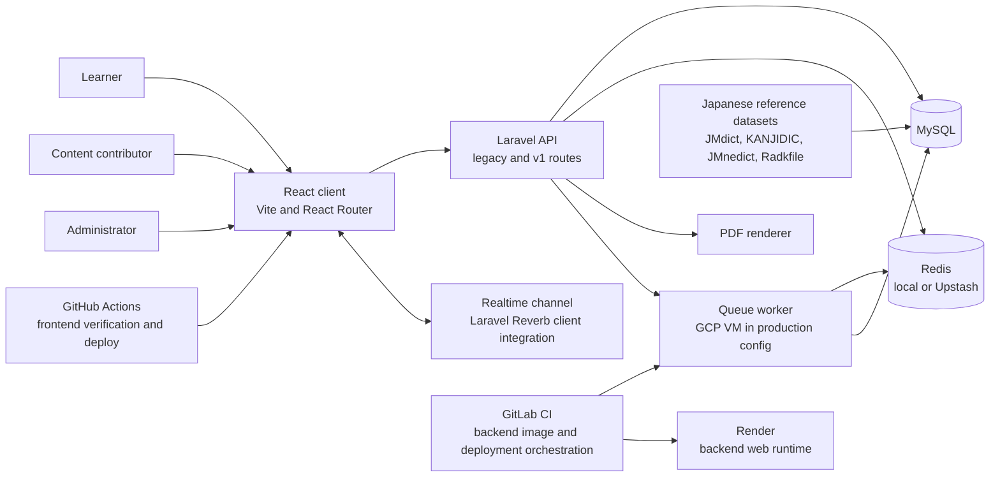

# System Context

> **Status:** Baseline; configured topology distinguished from live verification
> **Last reviewed:** 2026-08-18
> **Evidence baseline:** Repository working tree inspected on 2026-08-18
> **Audience:** Engineers, operators, reviewers, and AI-assisted contributors

## Purpose

Japanese VMA is a browser-based Japanese learning platform. Learners browse study resources, read and publish articles, organize material in catalogues, and interact with community content. Administrators manage users and selected moderation workflows.

## Context Diagram

## People and Concerns

| Actor | Main concerns |
|---|---|
| Learner | Discoverable Japanese material, readable content, saved study state, predictable navigation, and responsive pages. |
| Content contributor | Article and community authoring, editing, processing feedback, and visibility controls. |
| Administrator | User/role administration and moderation workflows with enforced backend authorization. |
| Developer | Clear legacy/v1 boundaries, generated contract stability, testable modules, and safe incremental migration. |
| Operator | Independent web/worker health, queue visibility, deploy ordering, rollback boundaries, and secret isolation. |

## System Boundaries

### Verified current

- The React client calls both generated v1 clients and legacy API adapters.
- The Laravel backend exposes both `processor-api/routes/api_v1.php` and `processor-api/routes/api.php`.
- MySQL is the dedicated database in the Docker development and test topology.
- Redis supports cache, queue, and realtime coordination according to backend configuration.
- Article processing jobs and PDF services are explicit application boundaries.

### Verified configuration; live state not inspected

- `.github/workflows/frontend-ci.yml` defines frontend verification and deployment.
- `.gitlab-ci.yml` defines backend image creation, GCP worker deployment/verification, and a Render deployment trigger.
- Production guidance identifies Upstash Redis as the shared queue/cache backend.

### Inferred trust boundaries

- Browser-to-API traffic crosses a public network and must enforce authentication, authorization, CORS, and safe error handling at the API boundary.
- CI systems and hosting providers hold deployment credentials not represented in source.
- Imported Japanese datasets are trusted reference inputs but still require deterministic parsing and migration checks.

## Primary Product Capabilities

- Browse articles, kanji, radicals, words, sentences, and catalogues.
- Authenticate and manage personal content.
- Create and maintain articles and catalogues.
- Attach Japanese study material to articles through background processing.
- Comment, like, tag, view, and download supported entities.
- Export supported article and catalogue study data as PDFs.
- Browse and author community posts through legacy surfaces pending migration.

## Related Views

- [Application boundaries](./application-boundaries.md)
- [Deployment and runtime](./deployment-and-runtime.md)
- [Data and integrations](./data-and-integrations.md)
- [Architecture description](../ai/architecture-description.md)
