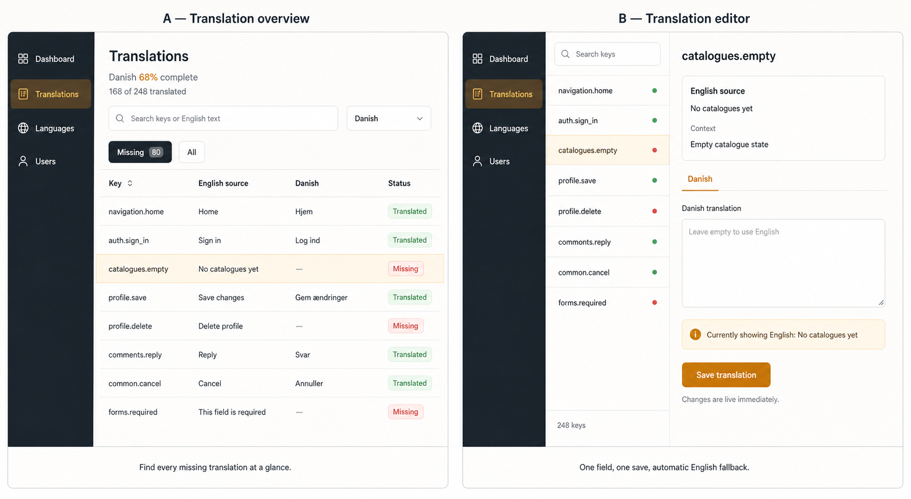

# Translation Management Design Specification

Status: Draft ready for review

Date: 2026-08-18

Scope: Static application labels and short UI text in the React client, managed through the Laravel API and Filament admin panel

Implementation: Not started

## Summary

Japanese VMA will use English as the required source language and allow administrators to add non-English variants in Filament. A translated value is live as soon as it is saved. When the selected-language value does not exist, the application displays the English source value.

The workflow deliberately has only two derived states:

- **Translated:** a non-empty override exists for the selected locale.
- **Missing:** no non-empty override exists, so the English source is displayed.

There are no draft, publish, stale, approval, or revision states in this version. Those workflows must not be introduced until a concrete business requirement justifies them.

## Approved Visual Direction

The approved experience combines:

1. **Translation overview:** searchable English keys and values, a selected target locale, completion counts, and a Missing filter.
2. **Translation editor:** one read-only English source and one editable target-language value with a single Save action.



The image is a design reference, not production-ready UI or an exact Filament component contract.

## Problem

The React client currently contains user-visible English strings directly in components and has no application-wide translation provider. Laravel is configured with English as both its locale and fallback locale and contains only the framework's standard English language files. Filament 5.6 is installed and already provides authenticated User and Role resources, but it has no translation-management surface.

Laravel supplies locale selection, language-file lookup, and fallback behavior for Laravel-rendered strings. It does not supply database-managed translations, missing-translation reporting, completion counts, a Filament editing workflow, or automatic translation of the separate React client. Those product-specific capabilities belong to this feature.

## Goals

1. Keep one authoritative English source for every managed UI label.
2. Allow an authorized administrator to add, update, or clear a value for any active non-English locale.
3. Apply saved values immediately without a separate publication step.
4. Fall back to the exact English source whenever the selected-locale value is missing.
5. Make missing translations easy to search, filter, count, and complete.
6. Provide locale bundles to the React client through a documented v1 API.
7. Support incremental migration from existing hard-coded English labels.
8. Fit the repository's modular-monolith and thin-HTTP architecture direction.

## Non-Goals

- Draft, review, approval, or publish workflows.
- Stale-translation or English-source revision tracking.
- Translation history, rollback, or audit versioning beyond ordinary timestamps.
- Machine translation or integration with DeepL, Google Translate, OpenAI, Crowdin, Lokalise, or another translation-management service.
- Import/export through CSV, spreadsheets, or external agencies.
- Translation of user-authored articles, comments, catalogue descriptions, Japanese dictionary data, or other domain content.
- Model-field translation through JSON columns or Spatie Translatable.
- ICU message formatting, plural rules, grammatical variants, or parameter interpolation in the first delivery.
- Right-to-left layout work.
- Redis caching or queue processing before measured traffic demonstrates a need.
- Migrating every existing React string in one release.

## Product Rules

### Source language

- English (`en`) is the required source and fallback locale.
- English labels use stable semantic keys such as `navigation.home`, `auth.sign_in`, and `catalogues.empty`.
- English source labels are code-owned and stored in the backend language catalogue under `processor-api/resources/lang/en/ui.php`.
- The translation editor shows English as read-only. English changes are made through normal code review.
- Removing or renaming a key is a code change. A rename is treated as removing one key and adding another; translations are not guessed or moved automatically.

### Target locales

- A locale has a unique code, display name, and active flag.
- English is seeded, permanently active, and cannot be deleted or disabled.
- Administrators with locale-management permission may add, activate, or deactivate non-English locales.
- Deactivating a locale prevents runtime selection but preserves its translations.
- Locale codes use one canonical project format. Initial codes should use simple lowercase ISO 639-1 values such as `da`, `de`, and `ja`; region-specific support can be added when required.

### Translation values

- The database stores only non-English overrides.
- A non-empty trimmed value means Translated.
- An absent value means Missing.
- Saving an empty or whitespace-only value removes the override instead of storing an empty string.
- Saving a non-empty value upserts the override and makes it visible on the next bundle request.
- A changed English source does not alter or flag an existing target-locale value. It remains Translated until cleared or edited.

### Resolution

For a known source key and requested active locale:

```text
non-empty locale override exists -> return locale override
otherwise                        -> return English source
```

The API never returns an empty string for a known managed key. An unknown source key is a developer error and returns the key itself in the client development experience rather than silently producing an empty label.

## Data Model

### `translation_locales`

| Column      | Purpose                                      |
| ----------- | -------------------------------------------- |
| `id`        | Internal primary key                         |
| `code`      | Unique locale code                           |
| `name`      | Human-readable locale name                   |
| `is_active` | Whether runtime clients may select the locale |
| timestamps  | Ordinary creation and update timestamps      |

English is represented so it can appear in locale selectors and API metadata, but its values continue to come from the source catalogue rather than translation rows.

### `translations`

| Column               | Purpose                                             |
| -------------------- | --------------------------------------------------- |
| `id`                 | Internal primary key                                |
| `translation_locale_id` | Owning non-English locale                       |
| `key`                | Stable source key                                   |
| `value`              | Non-empty translated value                          |
| timestamps           | Ordinary creation and update timestamps             |

Required constraints:

- Unique index on `(translation_locale_id, key)`.
- Foreign key from locale to `translation_locales`.
- Application validation rejects English rows and empty values.

There is intentionally no `translation_keys` table and no status column. Source keys are enumerated from the English catalogue, and Missing/Translated is derived by comparing that catalogue with override rows.

## Backend Architecture

The feature is a focused `Translations` module following the repository's preferred flow:

```text
routes/api_v1.php
  -> v1 controller/request
  -> translation application service
  -> source catalogue + repository interface
  -> Eloquent repository/models
  -> v1 resource + TypedResults
```

### Source catalogue

A source-catalogue adapter reads and flattens `resources/lang/en/ui.php` into a stable `array<string, string>`. It owns key enumeration and English lookup. HTTP controllers, Filament pages, and Eloquent models must not read language files independently.

### Translation service

The application service owns:

- validating that a target key exists in the English catalogue;
- validating that the requested locale exists and is active when used at runtime;
- deriving Missing/Translated state;
- upserting or removing overrides;
- producing merged runtime bundles;
- calculating completion counts.

### Repository

The repository owns loading overrides by locale and key, upserting non-empty values, deleting cleared values, and batch-loading all values needed for a list or bundle. Filament tables must not issue one query per key.

## API Contract

### Locale catalogue

`GET /api/v1/translations/locales`

Returns active runtime locales and identifies English as the fallback. This route must be declared before a parameterized locale route so it cannot be shadowed.

### Translation bundle

`GET /api/v1/translations/{locale}`

Returns a complete, flat key/value map for the requested active locale. The server merges non-empty overrides over English before responding.

Conceptual payload:

```json
{
  "success": true,
  "data": {
    "locale": "da",
    "fallback_locale": "en",
    "messages": {
      "navigation.home": "Hjem",
      "auth.sign_in": "Log ind",
      "catalogues.empty": "No catalogues yet"
    }
  }
}
```

`catalogues.empty` demonstrates server-side English fallback. The client does not need a second request to resolve missing values.

Required behavior:

- `en` returns the source catalogue.
- An active target locale returns the fully merged catalogue.
- An unknown or inactive locale returns a typed not-found or validation error consistent with neighboring v1 endpoints.
- Public bundle reads do not require administrator authentication.
- Filament write operations remain authenticated and authorized through the panel; no public translation-write endpoint is required for the first delivery.
- The response is documented through Scramble and regenerated through the required `composer openapi` then `npm run orval:file` sequence.

## Filament Experience

### Translation overview

The overview is a custom Filament page backed by the translation service because its rows originate from the English source catalogue, including keys with no database row.

It provides:

- target-locale selector;
- search across key, English source, and available translated value;
- All and Missing filters;
- exact count and percentage, such as `168 of 248 translated` and `68% complete`;
- columns for Key, English source, selected locale, and derived status;
- Translated and Missing badges only;
- row navigation to the focused editor.

Completion is calculated as:

```text
translated source keys / total active English source keys
```

Orphaned database rows whose keys no longer exist in English are excluded from the count and runtime bundle. Cleanup tooling may be added later if orphaning becomes frequent.

### Translation editor

The focused editor provides:

- searchable source-key navigation;
- read-only key and English source;
- selected target locale;
- one translation textarea;
- helper text: `Leave empty to use English`;
- a visible fallback preview when the field is empty;
- one Save translation action;
- confirmation that changes are live immediately.

Saving a blank field deletes the override and returns the record to Missing. Saving non-empty text returns it to Translated.

### Locale management

A separate Filament resource manages non-English locales. English is protected from deletion and deactivation. Removing a non-English locale is not exposed in the first delivery; deactivation is the reversible operation.

### Authorization

The existing role/permission system should add separate abilities for:

- viewing translations and completion;
- editing translation values;
- managing locales.

Viewing the Filament dashboard alone must not implicitly authorize translation changes.

## React Client Integration

The React client gets a small translation boundary instead of distributing raw bundle access through components:

```text
application bootstrap / locale change
  -> generated translation-bundle client
  -> TranslationProvider
  -> t('navigation.home')
```

Required behavior:

- Default locale is English.
- The selected locale is persisted locally for anonymous users.
- Locale resolution order is: persisted active choice, supported base browser locale, then English.
- Changing locale fetches one complete merged bundle and updates visible labels without a full page reload.
- Components consume a translation function or hook; they do not fetch bundles directly.
- While a new locale loads, the currently rendered bundle remains visible.
- If a locale request fails, the client keeps the currently rendered bundle and presents a non-destructive error rather than replacing labels with blanks.
- During incremental migration, labels not yet moved into the translation boundary remain their existing English strings.

The first delivery may use a small project-owned provider because the approved scope is static key/value labels only. Adopting `i18next`, `react-i18next`, or another dependency requires a separate dependency decision when pluralization, interpolation, namespaces, or advanced locale negotiation enters scope.

## Error and Edge-Case Behavior

- Empty and whitespace-only saves remove the override.
- A save for a source key that no longer exists is rejected and the editor refreshes its source list.
- A locale deactivated while an editor is open rejects the save and asks the user to select an active locale.
- Two administrators editing the same key use last-write-wins behavior in the first delivery. Ordinary timestamps remain available for diagnosis, but optimistic locking is out of scope.
- Translation values are limited to 2,000 characters and use a textarea in Filament.
- HTML is treated as text. Managed translations must not become an arbitrary HTML injection channel.
- Orphaned overrides never appear in runtime bundles.

## Testing Strategy

### Backend domain/application tests

- A locale override replaces the English source.
- A missing override resolves to English.
- Clearing an override deletes it and restores English fallback.
- Completion counts include every English key and only valid non-empty overrides.
- Orphaned overrides are excluded.
- English cannot be stored as a target override.

### Backend feature tests

- English and target-locale bundle responses follow the documented v1 contract.
- Unknown and inactive locales return the intended typed error.
- The locale-catalogue route is not shadowed by the parameterized locale route.
- Filament authorization prevents unauthorized edits and locale management.
- The overview Missing filter and save/clear behavior work against the dedicated test database.

Backend DB-backed tests run through the repository's dedicated Docker test lane.

### Frontend tests

- The provider renders a fetched locale bundle.
- Locale changes preserve the current bundle while loading.
- Request failure preserves readable labels.
- Selected locale persists locally.
- Representative components use keys through the shared boundary.

Frontend verification includes relevant Vitest tests, `npm run typecheck`, and a production build. A sandbox `spawn EPERM` from Vite/esbuild must be rechecked outside the sandbox before being treated as a product failure.

## Migration and Rollout

1. Add locale and translation persistence plus the English source-catalogue adapter.
2. Add bundle and locale-list v1 endpoints and verify the generated OpenAPI contract.
3. Add Filament locale management and the A+B translation workflow.
4. Add the React translation boundary and locale selection.
5. Migrate a small representative set: shared navigation, authentication actions, common buttons, and one empty state.
6. Verify fallback, missing counts, immediate saves, and a production client build.
7. Migrate remaining static labels incrementally by feature.

Existing hard-coded English remains valid until each component is deliberately migrated. The implementation must not combine translation adoption with unrelated modernization of legacy routes.

## Acceptance Criteria

1. English is the protected source and fallback locale.
2. Every managed key has a non-empty English source.
3. A target-locale value is either Translated or Missing; no other workflow status exists.
4. Saving non-empty text makes it visible on the next runtime bundle request.
5. Saving empty or whitespace-only text removes the override and restores English fallback.
6. The overview can search keys and values and filter all Missing entries for the selected locale.
7. Completion count and percentage exactly match valid translated overrides divided by English keys.
8. The focused editor shows English, the target field, the fallback message, and one Save action.
9. Active locale bundles are complete and contain no empty values.
10. Unknown, inactive, and unauthorized operations fail explicitly without corrupting translations.
11. React components access translations through one shared boundary rather than direct API calls.
12. The initial rollout proves English fallback and live target-language updates on representative UI surfaces.
13. Generated API types originate from the backend schema and are not hand-edited.

## Implementation Plan Handoff

The implementation plan must:

- keep backend, Filament, API contract, and React integration as reviewable vertical slices;
- enumerate the initial English keys and representative client surfaces;
- preserve unrelated worktree changes;
- add migrations, factories, and focused tests before Filament and client consumers;
- use batch queries for overview and bundle generation;
- run backend OpenAPI generation before Orval generation;
- include deletion of the old terminal logic prototype once this specification has replaced its purpose;
- treat the approved mockup as a workflow reference rather than production code.

This specification authorizes planning and local implementation only. It does not authorize production deployment or installation of third-party translation packages.

## References

- [Laravel 12 localization](https://laravel.com/docs/12.x/localization)
- [Filament 5 relationship management](https://filamentphp.com/docs/5.x/resources/managing-relationships)
